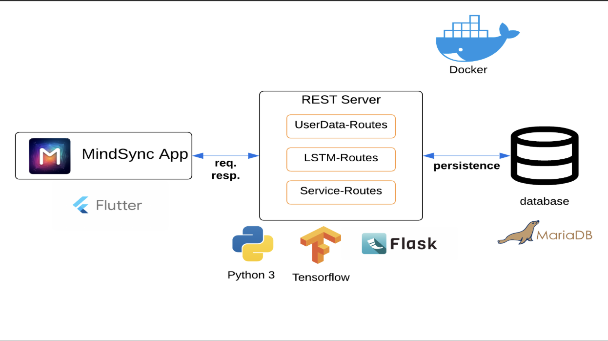
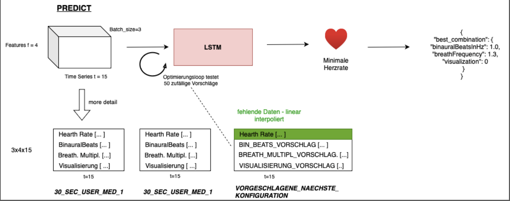
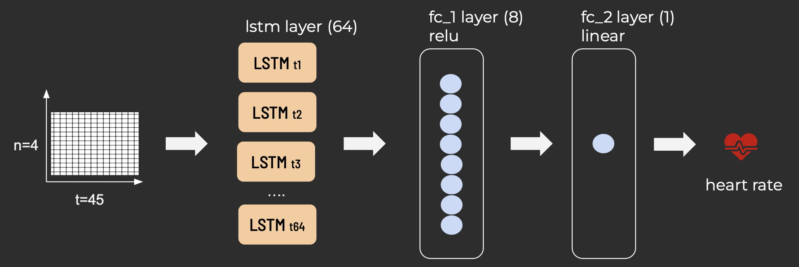

  
# MindSync Backend  
  
This project includes the backend for the [MindSync](https://github.com/marvpaul/flutter-meditation) meditation app.   
It consists of a REST server, a database, and an LSTMK machine learning model.  
  
## Table of contents  

<!-- TOC -->
* [MindSync Backend](#mindsync-backend-)
  * [Table of contents](#table-of-contents-)
* [System architecture overview](#system-architecture-overview)
* [Deployment](#deployment)
  * [deployment using docker compose](#deployment-using-docker-compose-)
  * [deploy manually](#deploy-manually-)
* [Extend Backend](#extend-backend)
  * [Editing/Adding Endpoints](#editingadding-endpoints)
  * [Making Changes to the Machine Learning Model](#making-changes-to-the-machine-learning-model)
  * [Unit tests](#unit-tests)
* [Integration tests](#integration-tests-)
  * [run tests](#run-tests-)
  * [Add new testsuites](#add-new-testsuites)
* [CI/CD pipeline](#cicd-pipeline-)
  * [Integration tests within CI/CD pipeline](#integration-tests-within-cicd-pipeline-)
  * [Continuous Deployment](#continuous-deployment-)
* [Machine Learning architecture](#machine-learningarchitecure-)
<!-- TOC -->

# System architecture overview

This diagram is intended to provide you an overview of the fundamental architecture of the entire system.



In the presented system architecture, a Client-Server model is employed, featuring a Flutter app as the client and a REST server component built with Flask in Python as the service provider. The Flutter app serves as the client, interacting with the REST server offering services.

The REST server is implemented in Python using Flask. The server component includes User-Data-Routes for managing app user data, LSTM-Routes for machine-learning-related functions, and Service-Routes handling meditation data. All specific data is stored in a MariaDB database, and Docker is utilized for containerization, offering advantages such as portability and consistency across environments.

The communication between components involves JSON over HTTPS for both requests and responses, ensuring secure data transfer.

This architecture aims to create a well-organized system, withtechnologies like Flutter, Flask, MariaDB, and Docker to provide a robust and scalable solution.

# Deployment
  
## deployment using docker compose  
  
To make the deployment easier docker compose can be used to start the MariaDB   
and flask server.  
  
### start containers  
  
- open directory `integration`  
- create an `.env` file from `.env.template`  
- start containers and wait until they are healthy:  
  
`docker compose up -d --wait`  
  
To view the logs from the rest-server container, the command `docker logs rest-server` can be used.  
  
### start solution using script  
  
On Linux machines, the `start_solution.sh` script can be used for deployment.   
By executing `./integration/start_solution.sh`, the current version of the repository is pulled, a .env file with   
default parameters is created, and the Docker containers are started.  
  
### stop containers  
  
`docker compose down`  
  
### rebuild server image  
  
After editing the source code of the backend, it's necessary to rebuild its docker image:  
  
`docker compose up -d --build --wait`  
  
## deploy manually  
  
### 1. Setup a MariaDB  
  
### 2. Install python dependencies  
  
`pip install -r requirements.txt`  
  
### 3. Set environment variables  
  
Create a `.env` file from `integration/.env.template` and set the correct variable values for your database.   
Make sure the .env file is located in the same directory as the execution directory from where you start the Flask   
server.  
  
### 4. Run Flask server  
  
`python3 src/server.py`

# Extend Backend

 

When making changes to the Python code, it's advisable to run the database using Docker Compose and execute the Python 
application either directly in the IDE or through the command line. 
It's important to note that all the required environment variables defined in `integration/.env.template` for the backend 
should be set.

To start only the database using the Docker Compose setup, you can use the following command:

`docker compose up -d database`

## Editing/Adding Endpoints

The endpoints of the REST server are defined in the `src/routes` package. A separate module has been created for each type of route. For a new endpoint of an already existing type, the corresponding module can be extended with a method for the new endpoint. If a new type of endpoint is to be added, it is advisable to create a new Python module.
 
## Making Changes to the Machine Learning Model

The entire code for the machine learning model, implemented using TensorFlow, is located in the Python module `src/lstm/meditation_lstm.py`. It is crucial, when making changes to this module, to ensure that the data format of the input values is preserved. Otherwise, the calling methods in the backend may no longer function properly.

## Unit tests

We wrote tests using Pytest for the helper functions in the backend. It's a good idea to test methods that deal with converting data and checking inputs. When adding new code to the backend, make sure to test it. You can find the tests we already have in the `src/tests` folder.
  
# Integration tests  
  
In the backend, integration tests were written to test the REST interface.   
The tests were implemented using the Robot Framework and can be found in the   
`integration_tests` folder.  
  
## run tests  
  
### 1. Deploy backend containers  
To execute the tests, it is necessary to [start the backend](#start-containers) beforehand using the docker compose setup.  
  
### 2. Install test dependencies  
  
Before the testsuite can be executed, it's necessary to install the test dependencies:  
  
`pip install -r requirements-test.txt`  
  
### 3. Run integration tests  
  
If the tests are to be executed on a Linux system, they can be started by invoking the following script:  
  
`./integration_tests/run_tests.sh`  
  
Otherwise, the following commands must be executed:  
  
```bash  
cd integration_tests  
python3 -m robot \--variablefile variables.py \  
--outputdir integration_test_results \  
-L DEBUG \  
-e PRIO2 \  
.  
```  

### 4. Inspect test results  
  
After the tests have been executed, the results can be found in the `integration_tests/integration_test_results` folder.  
There, you will find the test reports and logs.  

## Add new testsuites

We wrote integration tests using the Robot Framework, and you can find them in the `integration_tests` folder. The existing routes for managing meditation sessions and training the ML model are already tested using the `integration_tests/10_meditation_sessions.robot` test suite.

If you want to test new endpoints, create a separate `.robot` file. Test variables can be defined either in the `variables.py` file or directly in the test suite.
  
# CI/CD pipeline  
  
  
  
## Integration tests within CI/CD pipeline  
  
With each commit, the tests are executed within a CI/CD pipeline of the repository.   
The test results can be downloaded as a zip archive from there.   
This ensures that the code consistently meets a certain quality standard, and changes do not break previously   
functional code.

## Continuous Deployment  
  
With each push containing relevant changes for the backend, the backend is redeployed on the public VServer.   
This is implemented in the file `.github/workflows/deploy_solution.yml`. When the CI/CD pipeline is executed, an   
SSH connection is established to the VServer, and the [deployment script](#start-solution-using-script) is executed.  
  

# Machine learning architecure

The AI-mode in the app provides a personalized meditation experience by switching between visualizations, binaural beats, and breathing patterns as parameters. The neural network optimizes the meditation configuration to maximize its effectiveness
This diagram is intended to provide you an overview of the fundamental architecture of the machine learning.



In the shown Machine Learning architecture, the visualization outlines the fundamental structure. During meditation data like heart rate, binaural beats, breathing multiplier, and visualization type over time, are captured over time. Long Short-Term Memory networks (LSTMs) are perfect for such time-series data. LSTMs are widely used in time-series analysis, forecasting, and language modeling due to their efficacy in handling temporal dependencies.

LSTMs in this context take arrays as input, formed by parameters over time during meditation. The LSTM processes the data, utilizing the last 60 seconds' meditation data as a base and combining it with a proposed next meditation configuration (Shape 3 (data points) x 4 (parameters) x 15 time steps). An optimization loop integrates 50 random suggestions with past session data into the LSTM. This process occurs in the Predict method of the LSTM network, treating the minimum heart rate as the target, means it is a regression problem. The final outcome is the optimal configuration where the model delivers the lowest recorded heart rate.

We used TensorFlow and Keras as technologies, and we implemented everything using Python.

Zooming into the LSTM network's details, the architecture of the actual LSTM model is shown in the next visualization.



The neural network comprises multiple layers sequentially connected. On the left, the input data consists of four meditation parameterizations across 45 time steps. Initially, these enter the first LSTM layer with 64 neurons, capturing the temporal dependencies in the data. Subsequently, a Fully-Connected layer with 8 neurons and a ReLU activation function follows, adept at modeling non-linear relationships. Next in line is another Fully-Connected layer with one neuron and linear activation, well-suited for regression problems where the output is a metric-scaled value. The ultimate output of the neural network is the heart rate.